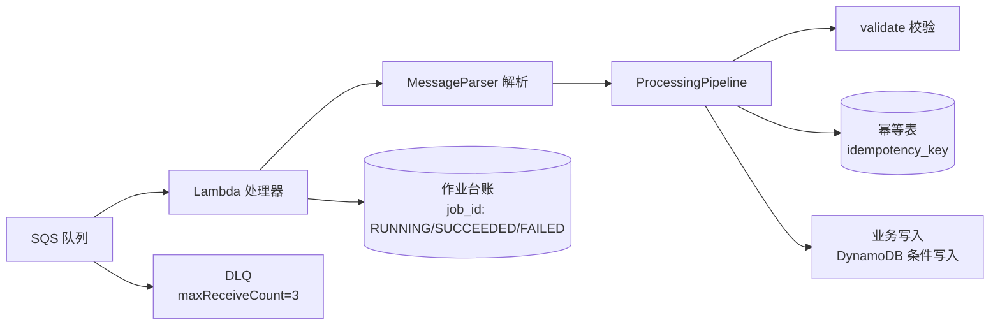

# 数据处理 Lambda 开发文档

| 项目 | 内容 |
|---|---|
| 文档版本 | 1.0 |
| 更新日期 | 2026-08-02 |
| 适用范围 | 本仓库 `data-processing-sample`、`data-processing-layer` 及 `skills/data-processing-lambda-generator` |
| 目标读者 | 开发、测试与运维数据处理 Lambda 的工程师 |

## 1. 概述

本仓库以 AWS SAM 为基础，提供一套「SQS 触发、校验先行、字段转换、幂等写入、作业台账」的数据处理 Lambda 开发范式：

- `data-processing-layer`：可复用的 Python 3.12 Lambda Layer，提供事件标准化、校验、幂等、作业管理与日志等通用能力。
- `data-processing-sample`：引用 Layer 的 POS 交易行数据处理示例，是新开发 Lambda 的参考模板。
- `skills/data-processing-lambda-generator`：根据 IF定義書 / IF変換説明書 自动生成上述 Lambda 的 Codex skill。

开发一个新接口（IF）的数据处理 Lambda 时，通常只需：复制 sample 模板 → 编写 Processor（校验 + 转换）→ 调整 SAM 模板 → 补充事件样例与单元测试 → 运行测试 → 部署。

## 2. 架构与数据流



核心设计：

- SQS 队列启用 `ReportBatchItemFailures`，Lambda 只返回失败记录，成功与重复记录直接确认。
- 消息以标准信封（`event_id`、`source_system`、`payload`）进入，业务载荷保留在 `payload` 中。
- `ProcessingPipeline` 保证「校验先行」：先 `validate()`，再按 `processor.name#event_id` 做幂等获取，最后才执行 `process()`。
- 业务写入本身也使用条件写入（`attribute_not_exists(event_id)`），与框架幂等形成双重防护。
- 每个任务在 `JobRuns` 表登记 `RUNNING`，结束时更新为 `SUCCEEDED` 或 `FAILED`。

## 3. 仓库结构

```text
serverless-data-processor/
├── data-processing-layer/                 # Lambda Layer（框架）
│   └── layer/python/data_processing_framework/
│       ├── models.py                      # DataEvent / ProcessingContext / ProcessingResult
│       ├── pipeline.py                    # DataProcessor 约定 / ProcessingPipeline
│       ├── idempotency.py                 # DynamoDbIdempotencyStore
│       ├── job_management.py              # DynamoDbJobRunManager
│       ├── message_parser.py              # MessageParser / ParsedMessage
│       ├── logging.py                     # JSON 日志 / log_context
│       ├── connection_pool.py             # DB-API 连接池
│       └── data_access.py                 # DatabaseRepository
├── data-processing-sample/                # 示例 Lambda（新开发模板）
│   ├── src/app.py                         # lambda_handler 与管线组装
│   ├── src/transaction_processor.py       # Processor（校验 + 转换）
│   ├── template.yaml                      # SAM 模板
│   ├── events/transaction.json            # 示例事件
│   └── tests/test_app.py                  # 单元测试
├── solution-design/solution-design.md     # 整体方案设计
└── skills/data-processing-lambda-generator/  # 自动生成 skill
```

## 4. 核心框架（data_processing_framework）

### 4.1 标准事件信封 DataEvent

所有消息统一为以下信封结构，业务载荷放在 `payload` 中：

```json
{
  "event_id": "pos-1001-20260802-0001",
  "source_system": "pos",
  "event_type": "transaction.received",
  "event_version": "1.0",
  "trace_id": "trace-1001",
  "payload": { "...": "业务字段" }
}
```

`DataEvent.from_message()` 要求 `event_id`、`source_system`、`payload`（dict）必填；`event_type`、`event_version` 有默认值；`trace_id`、`occurred_at`、`object_uri` 可选。

### 4.2 处理器约定与管线

每个业务处理器实现 `DataProcessor` 协议：

```python
class DataProcessor(Protocol):
    name: str                                   # 幂等键前缀，须唯一
    def validate(self, event: DataEvent) -> None: ...
    def process(self, event: DataEvent, context: ProcessingContext) -> dict: ...
```

`ProcessingPipeline.execute()` 的执行顺序：

1. 调用 `processor.validate(event)`——只校验，禁止产生副作用。
2. 以 `f"{processor.name}#{event.event_id}"` 调用幂等存储 `acquire()`。
3. 重复消息直接返回 `ProcessingResult(status="SUCCEEDED", duplicate=True)`，不执行 `process()`。
4. 首次消息调用 `processor.process()` 并返回结果。

### 4.3 幂等

`DynamoDbIdempotencyStore(table_name)` 使用 DynamoDB 条件写入实现去重，表结构要求 HASH 键 `idempotency_key`（S）。业务写入本身也应使用 `ConditionExpression="attribute_not_exists(event_id)"`，保证「框架幂等 + 业务幂等」双保险。

### 4.4 作业台账

`DynamoDbJobRunManager(table_name)` 提供任务生命周期管理，表结构要求 HASH 键 `job_id`（S）：

| 方法 | 行为 |
|---|---|
| `start(job_id, *, event_id, source_system, trace_id=None)` | 写入 `RUNNING`；重复启动返回 `False` |
| `complete(job_id, *, metrics=None)` | 更新为 `SUCCEEDED`，记录 `completed_at` |
| `fail(job_id, *, reason)` | 更新为 `FAILED`，记录 `failed_at` 与原因 |

### 4.5 消息解析

`MessageParser` 统一处理多种触发来源：

| 方法 | 说明 |
|---|---|
| `parse_records(event)` | 识别 SQS `Records` 或直接/EventBridge 事件 |
| `parse_sqs_record(record)` | 解析单条 SQS 记录，支持 SNS 包裹的 body |
| `parse_direct_event(event)` | 直接调用或 EventBridge（取 `detail`） |

返回 `ParsedMessage(message_id, data_event, raw_message)`。

### 4.6 日志

- `get_logger(name)`：输出 JSON 格式日志（含时间戳、级别、logger、message）。
- `log_context(**fields)`：上下文管理器，为日志附加 `event_id`、`trace_id` 等关联字段。
- `bind_log_context(**fields)`：模块级绑定关联字段。

### 4.7 数据库访问（可选）

当转换目标为 Aurora/RDS 时使用：

- `ConnectionPool(factory, max_size=4, timeout_seconds=5)`：DB-API 连接池，定义为模块级单例以复用 warm 环境连接。
- `DatabaseRepository(pool)`：提供 `transaction()`、`execute(sql, params)`、`fetch_all(sql, params)`。

数据库驱动（如 psycopg）不打包在 Layer 中，由业务 Lambda 自行引入；生产环境建议通过 RDS Proxy 访问。

## 5. 开发一个新的 IF 数据处理 Lambda

### 5.1 项目结构

每个 IF 一个独立 SAM 项目（参照 `data-processing-sample`）：

```text
<if-id>/
├── src/<if-id>_processor.py     # Processor：validate + process（业务逻辑）
├── src/app.py                   # lambda_handler 与管线组装
├── template.yaml                # SAM 模板
├── events/<if-id>.json          # 示例事件
└── tests/test_app.py            # 单元测试
```

### 5.2 实现处理器（src/transaction_processor.py 示例）

```python
"""POS transaction line processor: validation and normalization."""

import os
from decimal import Decimal, InvalidOperation

from data_processing_framework import DataEvent, ProcessingContext


class TransactionProcessor:
    name = "transaction-normalization"

    def __init__(self, table=None):
        self._table = table or _transactions_table()

    def validate(self, event: DataEvent) -> None:
        payload = event.payload
        required = ("transaction_id", "line_id", "store_id", "quantity", "unit_price", "currency_code")
        missing = [field for field in required if payload.get(field) in (None, "")]
        if missing:
            raise ValueError(f"Transaction payload missing: {', '.join(missing)}")
        if int(payload["quantity"]) <= 0:
            raise ValueError("quantity must be positive")
        try:
            Decimal(str(payload["unit_price"]))
        except InvalidOperation as exc:
            raise ValueError("unit_price must be numeric") from exc

    def process(self, event: DataEvent, context: ProcessingContext) -> dict:
        payload = event.payload
        quantity = Decimal(str(payload["quantity"]))
        unit_price = Decimal(str(payload["unit_price"]))
        item = {
            "event_id": event.event_id,
            "transaction_id": str(payload["transaction_id"]),
            "line_id": str(payload["line_id"]),
            "store_id": str(payload["store_id"]),
            "quantity": quantity,
            "unit_price": unit_price,
            "gross_amount": quantity * unit_price,
            "currency_code": str(payload["currency_code"]).upper(),
            "source_system": event.source_system,
            "trace_id": context.trace_id,
        }
        # 条件写入使业务写入本身幂等
        try:
            self._table.put_item(Item=item, ConditionExpression="attribute_not_exists(event_id)")
        except self._table.meta.client.exceptions.ConditionalCheckFailedException:
            pass
        return {"event_id": event.event_id, "gross_amount": str(item["gross_amount"])}


def _transactions_table():
    # boto3 由 Lambda 运行时提供；延迟导入便于无 AWS SDK 的单元测试
    import boto3

    return boto3.resource("dynamodb").Table(os.environ["TRANSACTIONS_TABLE"])
```

要点：

- `validate()` 只校验必填、类型、范围、格式、枚举；失败抛 `ValueError`（消息含字段名）。
- `process()` 中金额一律用 `Decimal` 计算；返回的摘要中数值转为 `str` 保证 JSON 可序列化。
- `name` 是幂等键前缀，同一套环境内必须唯一。
- 写入失败的业务项进入异常路径，由 `lambda_handler` 统一处理。

### 5.3 入口与管线组装（src/app.py）

```python
"""Sample POS transaction processor invoked from SQS."""

import os

from data_processing_framework import (
    DynamoDbIdempotencyStore,
    DynamoDbJobRunManager,
    MessageParser,
    ProcessingContext,
    ProcessingPipeline,
    get_logger,
    log_context,
)
from transaction_processor import TransactionProcessor

LOGGER = get_logger(__name__)
MESSAGE_PARSER = MessageParser()


def build_pipeline() -> ProcessingPipeline:
    return ProcessingPipeline(
        TransactionProcessor(),
        DynamoDbIdempotencyStore(os.environ["IDEMPOTENCY_TABLE"]),
    )


def build_job_run_manager() -> DynamoDbJobRunManager:
    return DynamoDbJobRunManager(os.environ["JOB_RUNS_TABLE"])


def lambda_handler(event, _context):
    """只重试失败记录；成功与重复记录均确认。"""
    pipeline = build_pipeline()
    job_runs = build_job_run_manager()
    failures = []
    for record in event.get("Records", []):
        job_id = None
        try:
            parsed = MESSAGE_PARSER.parse_sqs_record(record)
            data_event = parsed.data_event
            with log_context(event_id=data_event.event_id, trace_id=data_event.trace_id, message_id=parsed.message_id):
                job_id = str(parsed.raw_message.get("job_id", data_event.event_id))
                context = ProcessingContext(
                    job_id=job_id,
                    trace_id=str(parsed.raw_message.get("trace_id", data_event.event_id)),
                    attempt=int(parsed.raw_message.get("attempt", 1)),
                )
                created = job_runs.start(
                    job_id,
                    event_id=data_event.event_id,
                    source_system=data_event.source_system,
                    trace_id=context.trace_id,
                )
                LOGGER.info("Job started", extra={"job_id": job_id, "created": created})
                result = pipeline.execute(data_event, context)
                job_runs.complete(
                    job_id,
                    metrics={"processed_records": 1, "duplicate": result.duplicate},
                )
                LOGGER.info("Job completed", extra={"job_id": job_id, "status": "SUCCEEDED"})
                LOGGER.info("Transaction processed", extra={"status": result.status, "duplicate": result.duplicate})
        except Exception:
            if job_id is not None:
                try:
                    job_runs.fail(job_id, reason="See Lambda log for failure details")
                except Exception:
                    LOGGER.exception("Unable to mark job as failed", extra={"job_id": job_id})
            LOGGER.exception("Failed processing SQS record", extra={"message_id": record.get("messageId")})
            failures.append({"itemIdentifier": record["messageId"]})
    return {"batchItemFailures": failures}
```

新 IF 通常只需替换 Processor 类与表名，`lambda_handler` 结构保持不变。

### 5.4 SAM 模板（template.yaml）

参照 sample 的资源结构：

| 资源 | 说明 |
|---|---|
| `ProcessingDlq` | 死信队列 |
| `ProcessingQueue` | 主队列：`VisibilityTimeout: 180`、`RedrivePolicy: maxReceiveCount=3` |
| `Processed*`（输出表） | 业务输出表，HASH 键 `event_id`（S） |
| `IdempotencyLedger` | 幂等表，HASH 键 `idempotency_key`（S） |
| `JobRuns` | 作业台账，HASH 键 `job_id`（S） |
| `*Function` | Lambda：python3.12、Layers 引用 Layer ARN、SQS 事件 `BatchSize: 10` + `ReportBatchItemFailures` |

环境变量约定：

```yaml
Environment:
  Variables:
    IDEMPOTENCY_TABLE: !Ref IdempotencyLedger
    JOB_RUNS_TABLE: !Ref JobRuns
    <OUTPUT>_TABLE: !Ref <输出表>
```

权限使用 `DynamoDBCrudPolicy` 分别授予三张表；若输出目标为数据库，需另配网络与 Secret 策略。

### 5.5 示例事件

`events/<if-id>.json` 为一条 SQS Records 消息，body 为信封 JSON：

```json
{
  "Records": [
    {
      "messageId": "example-message-1",
      "body": "{\"event_id\":\"pos-1001-20260802-0001\",\"source_system\":\"pos\",\"event_type\":\"transaction.received\",\"event_version\":\"1.0\",\"trace_id\":\"trace-1001\",\"payload\":{\"transaction_id\":\"T-1001\",\"line_id\":\"1\",\"store_id\":\"1001\",\"quantity\":2,\"unit_price\":\"1980\",\"currency_code\":\"JPY\"}}"
    }
  ]
}
```

### 5.6 单元测试

测试直接注入 `table=object()` 避免依赖 boto3，覆盖：

- 每个必填字段缺失 → 断言 `ValueError` 且消息含字段名。
- 每个类型/范围/格式/枚举规则 → 断言拒绝。
- 每个转换规则 → 构造输入，断言输出字段值。
- 幂等 → 同一 `event_id` 第二次执行 `duplicate=True`。

```python
from transaction_processor import TransactionProcessor
from data_processing_framework import DataEvent, ProcessingContext

processor = TransactionProcessor(table=object())
event = DataEvent.from_message({"event_id": "1", "source_system": "pos", "payload": {}})
# 断言缺失字段校验
```

### 5.7 本地运行测试

在仓库根目录执行：

```bash
# Layer 测试
PYTHONPATH=data-processing-layer/layer/python python3 -m unittest discover -s data-processing-layer/tests -v

# 示例 Lambda 测试
PYTHONPATH=data-processing-layer/layer/python:data-processing-sample/src python3 -m unittest discover -s data-processing-sample/tests -v
```

### 5.8 部署

先部署 Layer 项目并取得 `LayerVersionArn`：

```bash
cd data-processing-layer
sam build --use-container   # psycopg 二进制需按 Lambda 运行时构建
sam deploy --guided
```

再部署使用方项目：

```bash
cd data-processing-sample
sam build
sam deploy --guided --parameter-overrides DataProcessingLayerArn=<layer-version-arn>
```

## 6. 可靠性设计

| 机制 | 说明 |
|---|---|
| 至少一次投递 + 幂等 | SQS 可能重复投递；以 `event_id` 条件写入实现幂等 |
| 失败重试 | `ReportBatchItemFailures` 只重试失败记录，避免整批重放 |
| DLQ | 每条队列独立 DLQ，`maxReceiveCount=3` 后进入死信队列 |
| 作业台账 | `RUNNING → SUCCEEDED/FAILED` 全生命周期可追溯 |
| JSON 日志 | 日志携带 `event_id`、`trace_id`、`job_id`，便于排查 |
| 校验先行 | 格式错误消息不进入台账与业务写入，可修正后重放 |

## 7. 开发规范与注意事项

- **校验先行**：`validate()` 不产生副作用；业务写入只在 `process()` 中发生。
- **Decimal 序列化**：金额计算使用 `Decimal`；输出前转为 `str`，否则无法 JSON 序列化。
- **幂等键**：`processor.name` 在同一环境中必须唯一，避免不同处理器键冲突。
- **环境变量**：表名一律通过环境变量注入，不硬编码。
- **boto3 延迟导入**：`_table()` 等辅助函数内延迟导入，保证单元测试无需 AWS SDK。
- **只使用框架导出 API**：`from data_processing_framework import ...`，不依赖框架内部实现。
- **命名**：IF 标识规范化为小写 kebab-case（`POS取引明細` → `pos-transaction`），处理器文件为 `<if-id>_processor.py`。
- **数据库输出**：连接池定义在模块级，驱动由业务函数自行引入，优先 RDS Proxy。

## 8. 使用 skill 自动生成（可选）

仓库内 `skills/data-processing-lambda-generator` 提供自动生成能力：

1. 将 skill 链接到 `~/.codex/skills/` 以便 Codex 自动发现。
2. 提供 IF定義書（输入字段、类型、必须性、格式）与 IF変換説明書（字段映射、変換ロジック、目标表）。
3. 调用 skill 后，它会为每个 IF 生成 `src/<if-id>_processor.py`、`src/app.py`、`template.yaml`、`events/<if-id>.json` 与 `tests/test_app.py`，并运行测试验证。

自动生成的代码同样遵循本文档第 5 节的规范。

## 9. 附录：框架 API 速查

| 对象 | 说明 |
|---|---|
| `DataEvent.from_message(message)` | 解析标准信封；必填 `event_id`、`source_system`、`payload` |
| `ProcessingContext(job_id, trace_id, attempt=1)` | 处理上下文 |
| `ProcessingResult(event_id, status, output, duplicate)` | 管线执行结果 |
| `ProcessingPipeline(processor, idempotency_store)` | 校验 → 幂等 → 处理 |
| `DynamoDbIdempotencyStore(table_name)` | DynamoDB 幂等存储 |
| `DynamoDbJobRunManager(table_name)` | 作业台账 `start/complete/fail` |
| `MessageParser` | SQS / SNS / EventBridge / 直接调用解析 |
| `get_logger(name)` / `log_context(**fields)` | JSON 日志与关联字段 |
| `ConnectionPool(factory)` / `DatabaseRepository(pool)` | 数据库连接池与仓储 |
