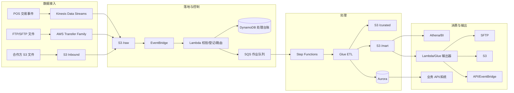
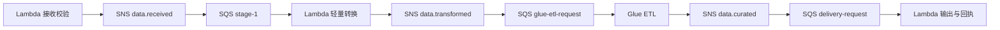

# 零售数据处理平台：详细方案设计

## 1. 目标与边界

平台负责接入 POS 实时交易、FTP/SFTP 批量文件和合作方 S3 文件；完成校验、清洗、标准化、关联及汇总；将结果提供给 Aurora 业务查询库、S3 数据湖及下游系统。方案以 AWS 托管和无服务器服务为主，支持按数据量弹性扩缩。

不在本方案内：POS 终端离线缓存逻辑、BI 报表前端、主数据的业务维护界面。

## 2. 逻辑架构与数据流

## 3. 存储与命名规范

### 3.1 S3 分层

| 层 | 目的 | 写入者 | 格式与保留 |
|---|---|---|---|
| `inbound` | 接收外部文件，未确认可用 | Transfer Family、外部账户 | 保留 30 天 |
| `raw` | 不可变的原始业务记录 | Firehose、Lambda | 原文件或 JSON；保留 7 年 |
| `quarantine` | 校验失败、无法解析的数据 | Lambda、Glue | 原文件 + 错误报告；保留 180 天 |
| `curated` | 统一字段和可追溯的明细 | Glue | Parquet + Snappy；保留 7 年 |
| `mart` | 面向主题与下游的数据集 | Glue | Parquet + Snappy；按业务需要保留 |
| `outbound` | 对外发送的制品与回执 | 输出作业 | 加密文件；保留 180 天 |

建议 Bucket 按环境分离（例如 `retail-data-prod`），前缀按域、来源、日期分区：

`s3://retail-data-prod/raw/pos/transaction/dt=2026-08-02/hour=13/store_id=1001/...`

在 `curated` 和 `mart` 中统一使用 UTC 分区；保留业务时区字段 `business_timezone` 与原始发生时间 `occurred_at_local`。

### 3.2 标准信封字段

所有进入 `raw` 后的记录应补齐以下字段，保留业务载荷 `payload`：

| 字段 | 含义 |
|---|---|
| `event_id` | 全局唯一事件 ID；POS 可为交易号 + 门店 + 业务日期 + 序号 |
| `source_system` / `source_file` | 数据来源及文件名 |
| `schema_version` | 载荷版本 |
| `occurred_at` / `ingested_at` | 业务发生与平台接收时间，UTC |
| `business_date` / `store_id` | 零售分析常用维度 |
| `record_hash` | 规范化字段后的 SHA-256，用于去重 |
| `trace_id` | 跨服务追踪 ID |

## 4. 接入与编排设计

### 4.1 POS 实时交易

POS 通过 HTTPS API Gateway 或 Kinesis Producer 写入 Kinesis Data Streams。推荐使用 Kinesis 分区键 `store_id`：同一门店内维持顺序，不同门店并行处理。Firehose 将流数据滚动写入 `raw`；Lambda 消费者只负责轻量校验、规范化与错误标记，避免在流中执行跨表查询。

POS 端必须提供稳定的 `event_id`，服务端以该键在 DynamoDB 台账中执行条件写入，实现至少一次投递下的幂等。

### 4.2 FTP/SFTP 文件

使用 AWS Transfer Family 的 SFTP 端点，将每个合作方或子系统映射到独立的 `inbound/<partner>/` 前缀。上传完成触发 S3 Event；由 EventBridge 规则过滤 `Object Created:CompleteMultipartUpload` 和 `Put` 事件，再触发校验 Lambda。

校验 Lambda 检查：文件扩展名、文件大小、命名规则、PGP 签名/解密状态、重复文件哈希、文件头和记录数。失败文件移动到 `quarantine`，同时生成 JSON 错误报告并发送告警。

### 4.3 多阶段事件处理链

ETL 使用 Lambda、SNS Topic 和 SQS 队列构成逐阶段异步处理链。每个文件或微批生成唯一 `job_id`；当前 Lambda 成功后发布 SNS 事件，下一阶段的 SQS 队列订阅该 Topic 并触发其消费者 Lambda。SNS 用于事件扇出，SQS 用于削峰、重试与消费隔离。

| 阶段 | Topic | 队列 | 职责 |
|---|---|---|---|
| 接收校验 | `data.received` | `stage-1` | 校验、去重、台账登记、生成 `job_id` |
| 轻量转换 | `data.transformed` | `glue-etl-request` | 解压、解密、规范化、生成 manifest |
| 重型 ETL | `data.curated` | `delivery-request` | Glue 清洗、关联、聚合并写入数据湖/Aurora |
| 输出 | `data.delivered`（可选） | 目标专属队列 | 发送制品、处理回执、更新状态 |

状态为：`RECEIVED → VALIDATING → VALIDATED → TRANSFORMING → TRANSFORMED → ETL_RUNNING → CURATED → DELIVERING → SUCCEEDED`；不可恢复错误转为 `FAILED`。

### 4.4 消息契约与可靠性

消息仅包含 `event_type`、`event_version`、`job_id`、`event_id`、`source_system`、`object_uri`、`manifest_uri`、`attempt`、`trace_id` 与 `occurred_at`；业务大载荷保留在 S3。

- 使用 `job_id + stage` 执行 DynamoDB 条件更新，实现幂等；重复消息直接确认。
- 每个队列配置独立 DLQ、`maxReceiveCount` 和指数退避；告警必须包含 `job_id`。
- Lambda 仅在本阶段完成且下一 SNS 事件发布成功后确认消息。
- Glue 完成事件由 EventBridge 发布到 `data.curated` Topic，关联 Glue `jobRunId` 与 `job_id`，无需轮询。

台账存于 DynamoDB，主键为 `source_system#object_key#version_id`，GSI 支持按 `job_id`、状态和业务日期查询。禁止仅以文件名判断是否已经处理。
## 5. ETL 与数据质量

### 5.1 Lambda 与 Glue 的职责

| 场景 | Lambda | Glue |
|---|---:|---:|
| 解压、解密、文件头校验 | 是 | 否 |
| 小文件 JSON/CSV 规范化 | 是 | 可选 |
| 大文件、跨文件 Join、聚合 | 否 | 是 |
| 维度关联、SCD 历史处理 | 否 | 是 |
| 写入分析 Parquet/Iceberg | 否 | 是 |
| 低延迟业务状态更新 | 是 | 可选 |

建议 `curated` 和 `mart` 采用 Apache Iceberg 表，配合 Glue Data Catalog 管理元数据，以支持 Schema 演进、ACID 写入和可控的回溯重跑。若初期数据量较小，也可先采用 Parquet + Glue Catalog，并预留 Iceberg 迁移路径。

### 5.2 质量规则与错误处理

质量规则分为三类：

| 级别 | 示例 | 处理 |
|---|---|---|
| 阻断 | 文件无法解密、关键列缺失、重复主键率超过阈值 | 停止批次，进入 `quarantine` |
| 记录级 | 金额非数值、未知门店、商品编码无效 | 有效记录继续；错误记录写入错误表 |
| 告警级 | 到达延迟、空文件、金额波动异常 | 继续处理并通知值班人员 |

每个 Glue 作业写出 `run_metrics`：输入数、成功数、拒绝数、重复数、延迟、输出路径和规则版本。数据质量结果与 `job_id` 关联，供运营追溯。

## 6. 参考数据模型

### 6.1 明细事实表：`fact_pos_transaction_line`

| 字段 | 说明 |
|---|---|
| `transaction_id`, `line_id` | 交易及行项目业务键 |
| `business_date`, `occurred_at`, `store_id`, `terminal_id` | 时间与门店维度 |
| `product_id`, `quantity`, `unit_price`, `gross_amount`, `discount_amount`, `net_amount`, `tax_amount` | 销售金额与数量 |
| `currency_code`, `payment_type`, `transaction_status` | 交易属性 |
| `source_system`, `event_id`, `record_hash`, `ingested_at`, `schema_version` | 血缘与审计字段 |

主键建议为 `(source_system, transaction_id, line_id)`。重传或更正数据应携带版本/更正标记；事实表保留全部变更记录，`mart` 中另维护“最新有效版本”视图。

### 6.2 Aurora 业务查询库

Aurora 仅承载对业务应用有明确低延迟需求的读模型，例如：门店日销售汇总、交易状态、库存增量、对账状态。避免将全量 POS 明细长期复制到 Aurora。

写入模式采用 Glue 写入 staging 表后由存储过程执行 `MERGE`，或通过 Lambda 批量写入。按 `event_id` / 业务键建立唯一约束；使用 RDS Proxy 管理 Lambda 连接，避免连接风暴。

## 7. 输出与接口契约

输出数据集先生成不可变制品至 `outbound/<target>/<job_id>/`，再投递到目标端。每次投递保存清单（行数、哈希、生成时间、规则版本）和回执。

| 目标 | 推荐方式 | 重试与确认 |
|---|---|---|
| 外部 SFTP | Transfer Family SFTP Connector 或 Lambda | 文件哈希 + 对方 ACK 文件 |
| 外部 S3 | 跨账户 IAM Role / S3 Access Point | Object Version + 清单 |
| HTTP API | Lambda + EventBridge/SQS | 幂等键、指数退避、DLQ |
| 内部事件 | EventBridge 自定义总线 | Schema Registry、重放策略 |

## 8. 安全、网络与治理

- 所有 S3 Bucket 启用 Block Public Access、Versioning、SSE-KMS、访问日志及最小权限 Bucket Policy。
- 将 Lambda、Glue Connector 和 Aurora 置于 VPC 私有子网；为 S3、Secrets Manager、CloudWatch、STS 配置 VPC Endpoint。
- Transfer Family 使用受管身份或企业 IdP；每个来源限定 Home Directory 和 IAM Role。
- 密钥、SFTP 凭据和数据库口令放入 Secrets Manager，设置轮换。不得写入代码、环境变量明文或文件名。
- 使用 Lake Formation 做数据湖表/列权限，区分 POS 原始敏感字段、财务字段和普通运营数据。
- 以 CloudTrail、CloudWatch Logs、S3 访问日志和 Glue 作业日志满足审计；涉及个人信息时实施字段脱敏、访问审批和生命周期策略。

## 9. 可观测性与运行目标

建议定义以下初始 SLO，并按业务调整：

| 指标 | 初始目标 |
|---|---|
| POS 事件到 `curated` 可用延迟 | P95 小于 5 分钟 |
| 批量文件到 `mart` 可用延迟 | 95% 小于 60 分钟 |
| 成功处理率 | 大于等于 99.5% |
| 数据重复率 | 小于等于 0.01% |
| 未处理失败告警确认时间 | 小于等于 15 分钟 |

CloudWatch Dashboard 应展示入站量、队列积压、Glue 成功率和时长、拒绝记录数、数据延迟、Aurora 写入失败及下游投递积压。所有告警通过 SNS 路由至值班渠道，并携带 `job_id`、来源、对象路径和失败原因。

## 10. IaC 与环境策略

使用 Terraform 或 AWS CDK 管理所有基础设施；模块边界建议为：`storage`、`ingestion`、`orchestration`、`etl`、`database`、`security`、`observability`。每个环境独立 AWS Account 或至少独立 VPC、KMS Key、Bucket 与数据库。

部署流水线顺序：基础网络与 KMS → S3/IAM/密钥 → 数据目录与数据库 → Lambda/Glue/Step Functions → 监控与告警。数据契约与 Glue 脚本纳入版本控制；生产发布前运行样本数据契约测试、数据质量测试和回放测试。

## 11. 分阶段交付

1. **MVP（4–6 周）**：S3 分层、一个 POS 接口、一个 SFTP 来源、文件台账、基础 Glue 清洗、Aurora 日汇总、告警。
2. **扩展（6–10 周）**：Step Functions 编排、Iceberg、数据质量规则库、对外输出和重放机制。
3. **治理优化（持续）**：Lake Formation、成本分摊、数据目录、主数据/SCD、容灾演练与容量调优。

## 12. 需在设计评审中确认的决策

1. POS 峰值 TPS、单日交易量、最大文件大小及处理时效。
2. 交易更正、撤销和迟到数据的业务规则及可回溯期限。
3. 数据分类（PII、支付、财务）与跨境/留存合规要求。
4. Aurora 的确切读写用例、RPO/RTO 与多区域要求。
5. 各 SFTP/API 对方的认证方式、回执机制、重传约定和可用窗口。
